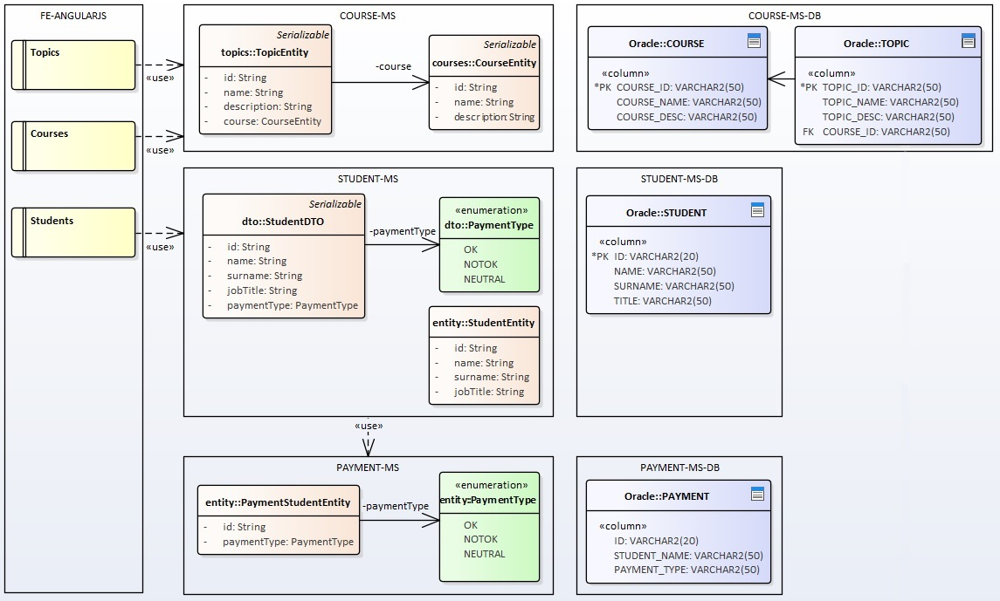

# campus-ms

### Front-end - Microservice - DB

# See all components
* [Course-MS](campus-course-ms/readme.md) Course microservice
* [Student-MS](campus-student-ms/readme.md) Student microservice
* [Payment-MS](campus-payment-ms/readme.md) Payment microservice
* [campus-angularjs](https://github.com/ermalaliraj/campus-angularjs) Front-End layer